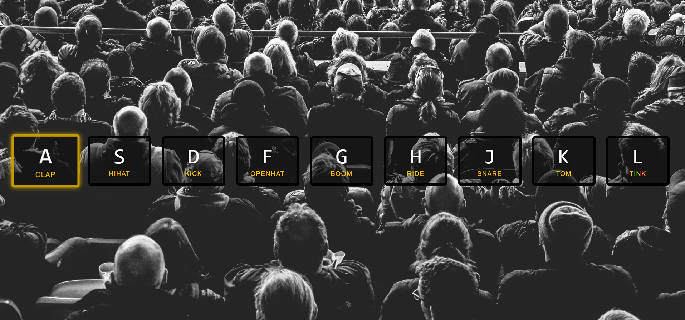

# JavaScript Drum Kit

This code allows users to play the drum kit by pressing predefined keys.

After pressing the key, the corresponding sound was played with a CSS transition. Then the effect was removed when the sound ended.

## Demo

### Changes
Changed keyCode value to key because 'keyCode' is deprecated.
 
