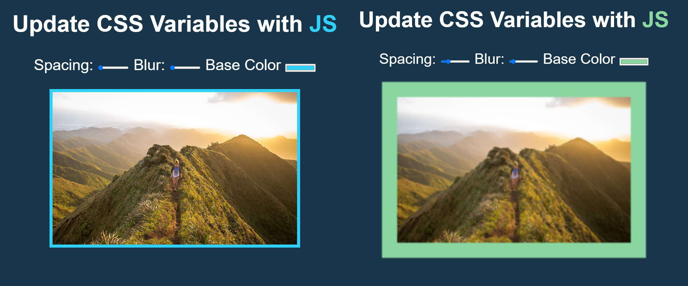

# Change styles by dragging the handles

This code shows how we can change the boarder, blur effect and color of the picture by dragging the handles.

## Demo

### Changes
Added an If statement in the Handleupdate function to distinguish value with px suffix and color, or if would add "undefined" as the suffix for the color instead of null.
