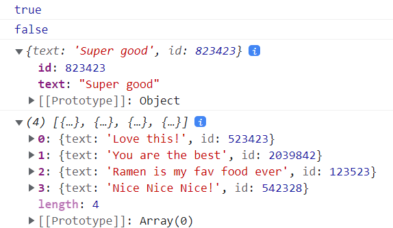

  # Array exercises

Use JS to sort arrays according to requirements. 

## Learning
Learned
```java
Array.prototype.some() // whether at least one element in the array passes the test
Array.prototype.every() // whether all the elements in the array pass the test
Array.prototype.find() // returns just the one you are looking for
Array.prototype.findIndex() // return the index
Array.slice(0, index) // return the elements from index 0 to index - 1
Array.slice(index + 1) // return the elements from index + 1 to the end
```

## Data
```java
// data to analyse
const people = [
      { name: 'Wes', year: 1988 },
      { name: 'Kait', year: 1986 },
      { name: 'Irv', year: 1970 },
      { name: 'Lux', year: 2015 }
    ];
```

```java
const comments = [
      { text: 'Love this!', id: 523423 },
      { text: 'Super good', id: 823423 },
      { text: 'You are the best', id: 2039842 },
      { text: 'Ramen is my fav food ever', id: 123523 },
      { text: 'Nice Nice Nice!', id: 542328 }
];
```

## Demo


